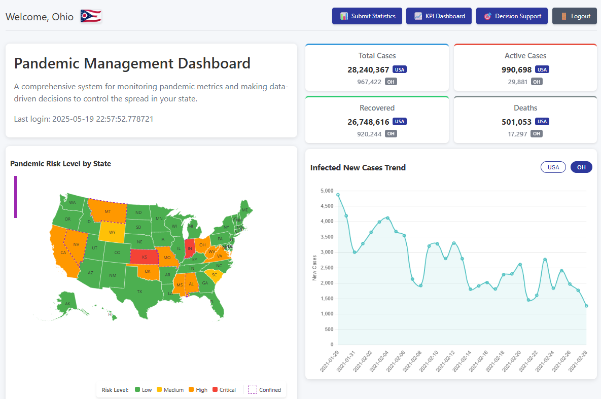
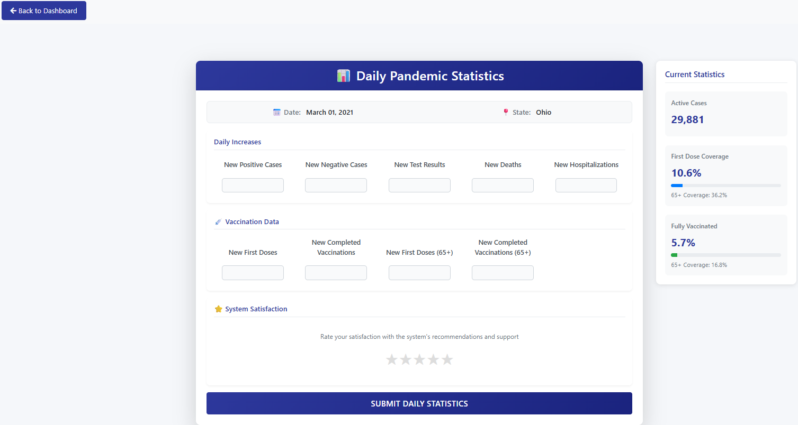

# IDSS-Pandemic Control

> **A Decision Support Tool for Pandemic Monitoring**

This project aims to help users monitor, predict, and better understand COVID-19 trends across the United States. By combining data science, machine learning, and interactive dashboards, we hope to provide useful insights into the pandemic—state by state, day by day.

---

## 🚀 See it in Action!



---

## What This Project Offers

- **COVID-19 Data Visualization:** View up-to-date pandemic data for each US state.
- **Prediction Models:** Explore forecasts for cases, hospitalizations, and deaths using Prophet models.
- **User Authentication:** State-based login for a more personalized experience.
- **Interactive Dashboards:** Analyze trends with interactive charts and statistical tools.
- **Clustering:** See how states group together based on COVID-19 patterns.

### Example: Statistics View



## 🗂️ Project Structure

```
app/
├── back-end/           # Flask application
│   ├── data/          # Data storage
│   │   ├── preprocessed/
│   │   │   └── dataMatrix/
│   │   │       ├── daily_covidMatrix.csv
│   │   │       └── static_stateMatrix.csv
│   │   ├── models/    # Trained Prophet models
│   │   └── clustering/
│   │       └── state_clusters.csv
│   └── app/           # Application code
└── front-end/         # React frontend
    ├── templates/     # HTML templates
    └── static/        # Static assets
```

## ⚡ Getting Started

1. **Install dependencies:**
```bash
pip install -r requirements.txt
```

2. **Initialize the database:**
```bash
flask db init
flask db migrate
flask db upgrade
```

3. **Run the application:**
```bash
python back-end/run.py
```

## 📊 Data Sources

- Official state COVID-19 data
- State-level demographic and healthcare datasets
- Vaccination statistics

## 🛠️ Technologies Used

- **Backend:** Flask, SQLAlchemy, Prophet
- **Frontend:** React, Chart.js
- **Database:** SQLite
- **Machine Learning:** Prophet, scikit-learn

---

*If you would like to showcase your dashboard, feel free to add a screenshot above. We hope you find this project helpful!*